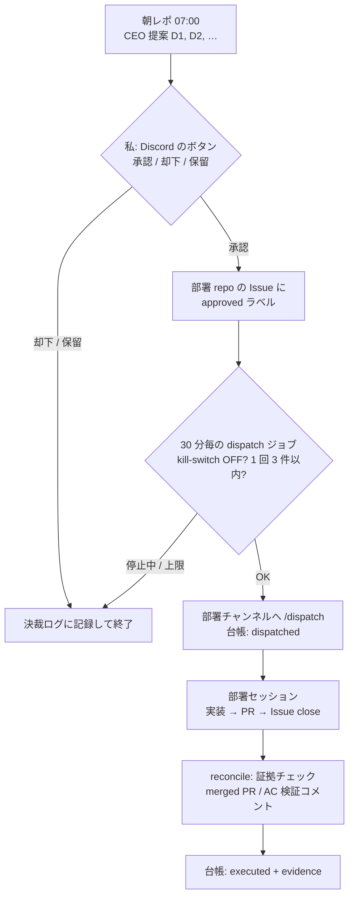

---

### TL;DR
* 「AIをつかって不労所得」「AIを使って会社を経営してみた」を、Claude Code で一人AI会社を作って5ヶ月やってみた
* 結果は売上0円。AIは直近30日だけで145件のPullRequestをマージしたが、AIの圧倒的な作業量は必ずしもビジネスの成果に直結しなかった
* 判断待ちが毎朝平均6.7件溜まり、Hookを50本仕込んだら手戻りの6割が設定ミスに。製品開発はいったん止め、この設計図と失敗を共有する方向へピボット。次は数値目標と撤退日をルール化する

### 概要

「完全自動化された不労所得ビジネスのリアル」です。

AIに全部仕事を任せて自分は寝て待つだけ、みたいな状況、一度は夢見たことないでしょうか？

今回は Claude Code などを活用して、AI会社を立ち上げ、それを5ヶ月間にわたって運用してみたという、私の実験レポートを報告していきます。

いわゆる、よくある「AIをつかって不労所得」「AIを使って会社を経営してみた」みたいなのを再現してみました

AIが24時間働き続けて、人間はそれを見守るだけ。そんな夢の設計図を描いたけど、実際どうだったか？

ズバリ、売上ゼロ円です!!!! 

AIは直近30日だけで145件ものPullRequestをマージして、もう猛烈なスピードでコードを書きまくっていたんです(主にClaudeが)。

それなのに5ヶ月の実際の売上はきっちり0円。AIの圧倒的な作業量が必ずしもビジネスとしての成果に直結しなかった！

これほどがんばったのに、なぜ収益を生み出せなかったんでしょうか。今日はこの0円AI会社の解剖、つまり検視報告として、こちらの4つのポイントで進めていきます。

* 一つ目、AI会社の設計
* 二つ目、人間の承認地獄。
* 三つ目、3つの致命的な失敗
* そして最後に、教訓と今後の戦略です。

---

### Section 1: AI会社の設計

開発や実装をAIに任せるためにどういう仕組みを作ったのか？

自分がボトルネックにならないように、GitHubのRepository上に本物の会社組織みたいなものを作ってみました

全体を統括する本社リポジトリがあって、そこから実際の製品開発を担うプロダクト開発リポジトリ、AIエージェントが働くための実行基盤を整備する基盤リポジトリ、そして各部署をつなぐハブ役のシステム間連携リポジトリっていう、一つの本社と3つの部署という構造です。

ちなみに製品の中身は [quickconv](https://github.com/miyashita337/convert-service) という、ブラウザで画像を HEIC・PNG・JPG・WebP・AVIF・PDF に変換する SaaS です。2026年3月に作り始めて、いまは休業中。コードは GitHub で公開しています。

ただAIにタスクを丸投げするんじゃなくて、きちんと役割分担を持たせた組織図をコード上に作り上げたわけです。発想としては悪くないはずでした。

そしてこの組織の中で、AIは24時間365日文句も言わずに働く労働力になります。

では私は何をするかというと、判断です。私の役割は、毎朝 Discord に送られてくる経営レポートに目を通して、承認か却下のボタンをポチッと押すだけ。

承認すればAIが自動で実務をスタートして、万が一暴走したら即座に止められるキルスイッチも用意しました。これぞまさに完璧な不労所得の青写真！！！

*図 1: 承認ゲートの流れ。私が押すのはボタンだけ、のはずでした*

そんな風に考えていた時期が、私にもありました。

---

### Section 2: 人間の承認地獄

ここからがセクション2、「人間の承認地獄」です。先ほど、人間はボタンを押すだけって言ったのですが....

でも実際には、毎朝起きるたびに平均して6.7件もの判断待ちタスクが溜まっている状態になっちゃったんです。

多い日にはこれが17件にも跳ね上がりました。AIが高速で稼働すればするほど、私の Discord には「これどうしますか?」「あれどうしますか?」っていう通知がずらりと並ぶわけです。

時間がある日はそれでも問題なかったけど、本業の繁忙期などになると、3件スルーすると次の日6件にたまり、6件をスルーすると12件になりと、延々とタスクが積まれていく毎日になりました

自分がボトルネックにならないためのAIだったはずが、気がつけば自分自身が終わりのない承認ループに閉じ込められてしまってました。

*図 2: 左 = 月別 dispatch 台帳（完了 / 滞留）と朝レポ配信日数、右 = 毎朝の判断待ち件数（8/25〜9/16）*

さらに commit ログを分析して、ちょっと信じられない事実がわかりました。直近30日で6つのリポジトリに積まれた commit 410件、その内訳なんですが、

なんと全体の97%がインフラの維持とか運用基盤整備といった運用業務に消えておりました。肝心の製品本体に割かれたのは、たったの12件、3%です。

つまりAIは顧客のための製品を作っていたんじゃなくて、自分たちが働くための環境づくりにほぼ全てのエネルギーを使っていたってことなんです。

これ、なぜこんな事態に陥ってしまったのか！？

---

### Section 3: 3つの致命的な失敗

失敗１：うまくいかない問題を「ハーネス」で制御しましたが、それでも制御できなかった

AIが規約を破る、危険なコマンドを打つ、承認を待たずに進む。こうした問題を、rules・hook・コマンドという「ハーネス」（AIの行動を縛る手綱）で制御しようとしました。ところが、規約に書いても守られない、hookは誤検知で正当な操作まで止める、承認済みの指示に確認質問を返して止まる、といったすり抜けと空回りが続きました。

もう一つ、ハーネスは「暴走」には効いても「停止」には効きませんでした。7月4日から8月6日までの33日間、毎朝届くはずの経営レポートが1通も来ていなかったのに、私は1ヶ月気づきませんでした。エラーが出るなら気づけます。怖いのは、エラーすら出さずに静かに止まることでした。ちゃんと動いているかを監視するウォッチドッグの仕組みが必要だと痛感した失敗です。

失敗２：「ループエンジニアリング」や「グラフエンジニアリング」を用いて徐々に良くしていこうとしていたが、Section2のように承認地獄で問題の先送り化

タスクを Issue → dispatch → PR → merge という依存グラフ（DAG）にして、依存のないものは並列に投入し、回すたびに少しずつ良くしていく。そういう設計でした。ところが、どの経路も最後は私の承認ゲートを通ります。並列にすればするほど承認待ちが同時に届き、Section 2 の承認地獄で止まって、改善のループ自体が回らなくなりました。先送りにした問題は消えずに、翌朝の判断待ちとして積み上がるだけでした。

失敗３：AIの手戻りを防ごうとして、コードの自動チェックを行うHookを、いつのまにか50本も仕込んでいました。安全性をガチガチに固めようとしたわけです。

でも設定を複雑にしすぎたせいで、記録した手戻り79件のうち6割（46件）が、フックや設定まわりのミスのせいになっちゃったんですよ。

システムを守るための過剰な防具が、システム自身を身動き取れなくしてしまったというわけです。

さらに、Hookを50本も仕込んだことで、AIが毎回読み込む規約やチェック結果が冗長に増え、Tokenを余計に食いつぶしていることにも気づきました。

---

### Section 4: 教訓と今後の戦略

ここからどう立て直すのか。「教訓と今後の戦略」です。

この失敗の5ヶ月のデータから、方向転換をしました。まず、直近の製品開発はスパッとやめます。

その代わり、この一人AI会社をどう設計してどこでつまずくのかというアーキテクチャの知見、つまり設計図そのものを共有する方向へピボットしたんです。

さらに、次回は数値目標を設定して、感情を挟まずにデータだけでいつプロジェクトを畳むかを決める「撤退日」を明確にルール化しました。

失敗をそのまま終わらせず、次の戦略へ生かそうと思います。

### 最後に

今回のレポートを締めくくるにあたって、最後に皆さんに問いかけたいことがあります。

皆様が今AIを使って作ろうとしているものは、本当に自動化されたビジネスですか？ それとも、自分自身へのタスクを猛烈なスピードで作り出すだけのマシンになっていませんか？

完全な自動化と、暴走を防ぐための人間による制御。この2つのバランスをどこで見つけるかが、今後のAIビジネスにおける最大の鍵になるはずです。

今回のレポートが皆さんのこれからのAI活用のヒントになれば嬉しいです。

<!-- 出典の再検証: bash scripts/verify-sources.sh ai-company-zero-revenue-autopsy -->
