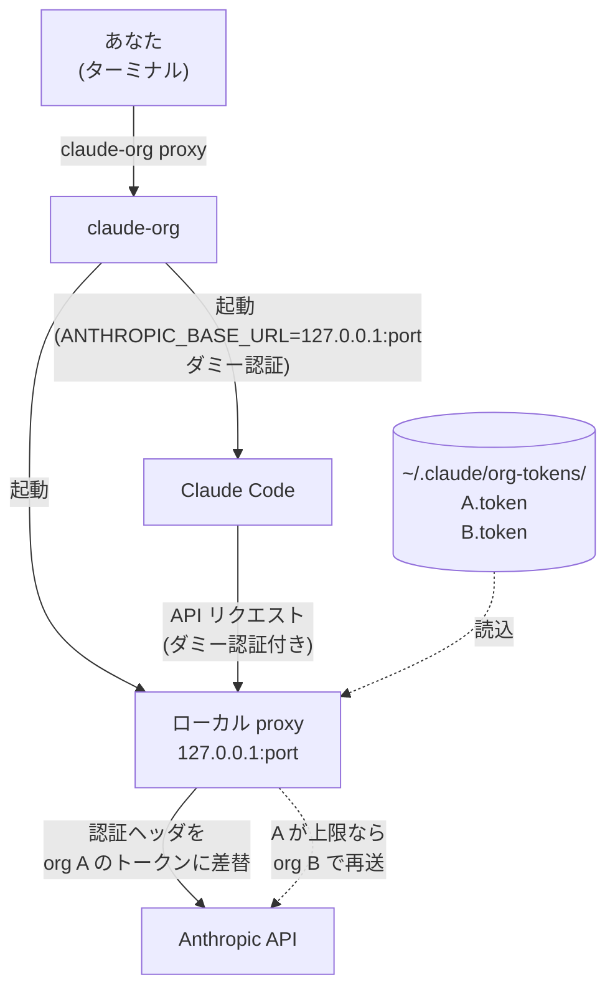
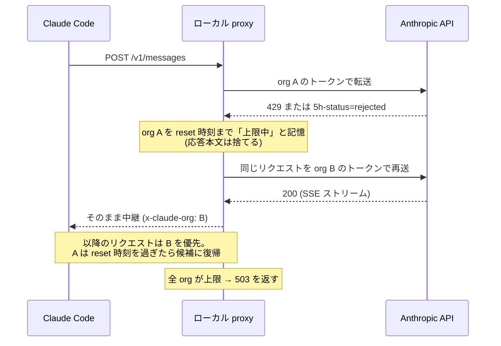

:::message
本記事は個人の運用記録です。複数 org の切替・トークン運用・ローカル proxy による認証ヘッダ差し替えは、各読者の環境・契約で利用規約に照らして自己責任で判断してください。OAuth トークンは本来「Claude Code などネイティブアプリの通常利用」向けの認証手段であり、第三者のリクエストを自分のサブスクリプション credential 経由で流す用途は Anthropic が明示的に禁じています（本ツールは自分の org 同士の切替のみで、他人のリクエストは扱いません）。
:::

## TL;DR

- 会社の Team org と個人の org を行き来していると、**5 時間枠の上限**で Claude Code が止まる
- `CLAUDE_CODE_OAUTH_TOKEN` が保存済みログインより優先される仕様を使い、org ごとのトークンで起動を切り替える CLI `claude-org` を作った
- さらにローカル proxy を挟む `claude-org proxy` で、**走行中のセッションのまま**上限到達の瞬間に別 org へフェイルオーバーできる
- npm パッケージとして公開した（`npm i -g claude-org`、依存ゼロ、Win/Mac/Linux）

## はじめに

Claude Code を個人 org と会社 org で併用しています。料金体系の都合上、個人側は Max、会社側は Team の座席で、どちらにも「5 時間ごとの使用量枠」があります。

困るのは、長時間の自律実行やレビュー祭りの最中に片方の枠が尽きることです。`claude` には org を切り替えるコマンドがなく、上限に当たると「待つ」しかない。もう片方の org は空いているのに。

セッション履歴は `~/.claude/` 配下で org をまたいで共有されるので、`--resume` で別 org に引き継ぐことは可能です。届かないのは「どの org の認証で起動するか」の切替だけ。届くのは起動前の環境変数のみ —— つまりラッパーを書くのが筋でした。

## やりたかったこと

1. `claude-org auto` で「使える方の org」で起動する
2. できれば走行中にも切り替えたい（長時間セッションで止まらない）
3. Win と Mac の両方で同じコマンド名で動く
4. トークンはローカルのみ、外部に出さない

## 最初のアプローチ: bash + PowerShell の二枚看板

最初は `claude-org.sh`（bash 212 行）と `claude-org.ps1`（PowerShell 99 行）を書きました。内部リポの `scripts/` に置いて symlink で `~/.claude/scripts/` に配る運用です。

これは動いたのですが、公開を考えると壁がありました。

- **ハマり 1: Windows は Git Bash 必須**。ps1 版は `probe` / `watch` / `auto` の判定を bash に委譲していたので、素の PowerShell では動きません。「Claude Code を使う層に Git Bash を要求する」のは配布物として弱い
- **ハマり 2: `date` の方言**。GNU `date -d` と BSD `date -r` を両対応させる処理が地味に脆い
- **ハマり 3: 通知が Pushover 直結**。個人運用の名残で `pushover-notify.sh` に依存しており、公開物には載せられない

で、決断。**全ロジックを Node に一本化**しました。Claude Code の動作要件が Node 18+ なので、`npm i -g` すればどの OS でも同じ実装が動き、npm が `.cmd` / `.ps1` の shim を自動生成してくれるため OS 別ラッパー自体が不要になります。

## 決定打 1: env 優先仕様で org を切り替える

Claude Code の認証は優先順位があり、`CLAUDE_CODE_OAUTH_TOKEN`（環境変数）は保存済み OAuth ログインより**先に**読まれます。

```
claude-org team --resume
  → CLAUDE_CODE_OAUTH_TOKEN=<team のトークン> claude --resume
```

トークンは org ごとに `claude setup-token` で発行し（有効期限 1 年）、`~/.claude/org-tokens/<name>.token` に置くだけ。あとは起動時に env を差し込むだけで、サインアウトせず別 org の課金枠で動きます。

## 決定打 2: 5h 枠の状態は応答ヘッダで読む

「その org が使えるか」の判定は、`/v1/messages` に `max_tokens: 1` の最小推論を 1 回投げ、応答ヘッダを読みます。

```
anthropic-ratelimit-unified-5h-status       allowed / rejected
anthropic-ratelimit-unified-5h-utilization  0.00-1.00
anthropic-ratelimit-unified-5h-reset        epoch（枠の復活時刻）
```

コストは 1 回あたり約 11 トークン。`claude-org probe team` と打てばこの値が 1 行で返り、`auto` はこれを見て preferred org / default org を選びます。

## 決定打 3: proxy で走行中の切替を実現する

`auto` の弱点は「起動時に 1 回しか判定しない」こと。長いセッションの途中で上限に当たると、429 が返って Claude Code が止まります。

そこで `claude-org proxy` は、Claude Code と API の間にセッション専用のローカル proxy（127.0.0.1 の空きポート）を挟みます。



Claude Code は「本物の API」ではなく手元の proxy に話しかけています。トークンを持つのは proxy だけで、リクエストごとに `Authorization` を差し替えます。だから Claude Code 側は何も知らなくてよく、**セッションを再起動せずに** org が切り替わります。

上限に当たったときの流れはこうです。



再送するのは `/v1/messages`（推論リクエスト）だけです。上限中の org は順番の末尾に回すだけで消さないので、全滅時の最後の望みとして試されます。SSE のストリーミング応答は加工せずパイプでそのまま流します。

実測では、1 プロセスの Claude Code に stream-json で 2 ターン流し、途中で preferred org を上限扱いにしたところ、同じプロセスのまま別 org のトークンで 2 ターン目が返りました（proxy ログは `POST /v1/messages via team -> 200` → `via max -> 200` の切替行を残します）。

`auto` との違いをまとめると:

| 入口 | 走行中の切替 | claude.ai コネクタ MCP | 向く場面 |
|---|---|---|---|
| `claude` | なし | 使える | Gmail / Slack 等を使う作業 |
| `claude-org auto` | 起動時のみ | preferred 時は不可 | 短い作業 |
| `claude-org proxy` | **自動** | 不可 | 長時間の実装・自律実行 |

proxy の弱点はコネクタ MCP と Remote Control が無効化される点です（外部トークン認証扱いになるため `mcp__claude_ai_*` が現れない）。GitHub や context7 のようなローカル MCP は使えます。

## 使い方

```bash
npm install -g claude-org        # Node 18+

claude setup-token               # org ごとにトークン発行
printf '%s' '<token>' > ~/.claude/org-tokens/team.token

claude-org list                  # 保存済み org
claude-org probe team            # 5h 枠の状態を 1 行で
claude-org proxy --resume        # 走行中自動切替つきで再開（推奨の入口）
claude-org auto --resume         # 起動時だけ使える方を選ぶ
claude-org watch                 # preferred の復活を裏で待つ
claude-org status                # 各 org の認証状態
```

`watch` の通知は `CLAUDE_ORG_NOTIFY_CMD` に外部化しました。例えば Pushover に投げたいなら `CLAUDE_ORG_NOTIFY_CMD=/path/to/pushover-notify.sh` のように好きな通知手段を差せます（未設定なら端末出力のみ）。

## ハマりポイントまとめ

| ハマり | 内容 | 対策 |
|---|---|---|
| ハマり 1 | PowerShell 版が Git Bash に依存して素の Win で動かない | Node に一本化して shim を npm に任せる |
| ハマり 2 | GNU date / BSD date の方言で HH:MM 変換が崩れる | `new Date(epoch)` に置き換え |
| ハマり 3 | `apiKeyHelper` 経路で 401 になる | 原因は `x-api-key` 同時送信。proxy で `x-api-key` を落として Bearer 単独で送る |
| ハマり 4 | OAuth トークンは「Bearer 単独なら 200、x-api-key 混在で 401」という非対称 | 実測 5 パターンで確認してからヘッダ操作を固定 |
| ハマり 5 | proxy セッションで claude.ai コネクタ MCP が消える | Claude Code の仕様。コネクタが要る作業は素の `claude --resume` で開き直す（履歴は共有） |

## おわりに

「5h 上限で止まる」を待ち時間にしないために、起動時判定（auto）と走行中切替（proxy）の 2 層に分けました。bash から Node への全面移植で配布可能な形になり、テストもスタブ upstream 前提の `node:test` に移して実 API を叩かない CI にしています。

同じ落とし穴にハマる人が減りますように。

## 参考リンク

- リポジトリ: https://github.com/miyashita337/claude-org （npm 名 `claude-org`）
- Claude Code 認証の優先順位: https://code.claude.com/docs/en/authentication
- Legal & Compliance（OAuth 認証の用途規定）: https://code.claude.com/docs/en/legal-and-compliance
