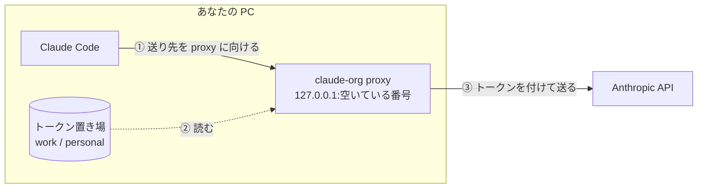
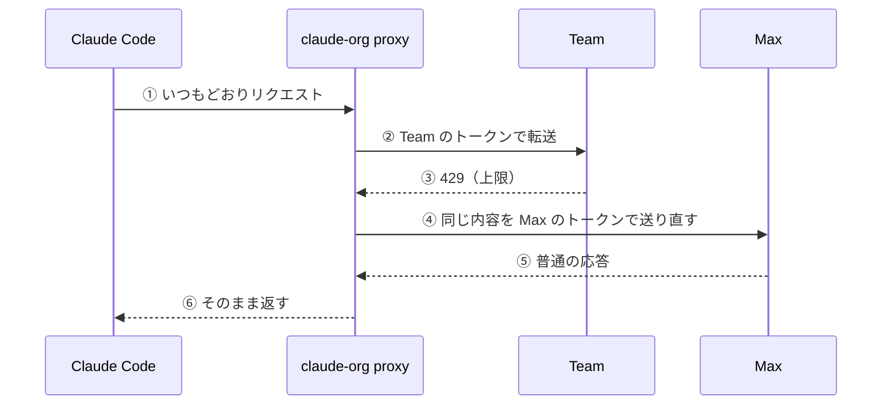

:::message
本記事は個人の運用記録です。複数 org の切替・トークン運用・ローカル proxy による認証ヘッダ差し替えは、各読者の環境・契約で利用規約に照らして自己責任で判断してください。本ツールは**自分が所属する org の、自分のトークン同士の切替**だけを扱い、他人のリクエストは中継しません。
:::

## TL;DR

- 会社の **Team org** と個人の **Max org** を併用していると、片方の上限で Claude Code が止まり、org の選び直しとセッションの引き継ぎが毎回発生する
- `claude` の代わりに `claude-org proxy` と打つだけで、**上限（429）に当たった瞬間に同じリクエストを別 org のトークンで送り直す** CLI `claude-org` を作った
- 実測 10 日間で自動切替 11 回、上限で作業が止まった回数 **0 回**。止まった原因は 5 時間枠ではなく **週の上限**だった
- 依存パッケージなしの Node CLI。`npm install -g claude-org`、Windows / macOS / Linux 対応

## はじめに

<!-- hearing:H2 -->
Claude Code を毎日使っていて、個人の Max プランでも週の途中で token が尽きるようになりました。そこで会社が契約した Team の org も使い始めました。使ってみた感覚では、Team の 1 席分は Pro プランとほぼ同じ量です。同じメールアドレスで 2 つの org に入っている状態です。

token が足りない問題は、Team を足すことでいったん解決しました。ところが Team と Max の 2 つを使い分け始めると、今度は**使い方そのものに手間がかかる**ようになりました。

## Team と Max を併用して困ったこと

<!-- hearing:H3 -->
| 困りごと | 中身 |
|---|---|
| 使えないモデルがある | Team では利用できないモデルがある（これは仕方ない） |
| 切り替えがしんどい | Max と Team の両方を使うと、毎回 org を選び直す |
| 使用量の上限 | 単発なら平気。並列セッションだとすぐ枯渇し、リセットまで待ち |
| 引き継ぎが冗長 | セッションを保存 → ログインし直し → 新セッションで読み込み直し、を毎回 |

欲しかったのは一言でいうと **「Team の token を使っていて、上限に来たら勝手に Max に移ってほしい」** でした。

Claude Code 標準の選択肢は、上限に来たら「リセットまで待つ」か「追加の使用量を買う」です。複数アカウントを `/login` で切り替えることはできますが、セッションの外から手でやる操作です。`claude-org` が足すのは 3 つ目の選択肢、**「もう払っている Max を使う」**です。

## 作ったもの: claude-org

コマンドは `claude` の代わりに `claude-org proxy` と打つだけです（短い別名 `ccorg` も入ります）。


*上: 手作業で乗り換える場合（止まっている時間は説明用のイメージ）。下: claude-org proxy の実測。10/13 17:38 に Team が上限に当たって Max に切り替わり、10/14 14:31 以降 Team に戻った*

| | Before（手作業） | After（claude-org proxy） |
|---|---|---|
| 上限に当たったとき | エラーで手が止まって、初めて気づく | 当たったことに気づかない |
| 乗り換え | セッションを保存して、Max でログインし直す | 同じセッションのまま Max で続く |
| Team が戻ったら | また同じ手順で戻す | 次のリクエストから自動で Team に戻る |

### 対象の人

- Team の org と、個人の org（Pro / Max）の 2 つを持っている（Team 同士・個人同士の組み合わせでも動きます）
- Claude Code を CLI で使っている
- **Free のアカウントでは使えません**。トークンの発行に使う `claude setup-token` は Pro / Max / Team / Enterprise の契約が必要です

## 仕組み: 上限の応答だけ、別の org で送り直す

`claude-org proxy` を実行すると、まず自分の PC の中だけで動く proxy（`127.0.0.1` の空いているポート）を立ち上げ、次に Claude Code を起動して送り先（`ANTHROPIC_BASE_URL`）をその proxy に向けます。


```mermaid
flowchart LR
  subgraph PC["あなたの PC"]
    CC["Claude Code"]
    PX["claude-org proxy<br/>127.0.0.1:空いている番号"]
    T[("トークン置き場<br/>work / personal")]
  end
  API["Anthropic API"]
  CC -->|"① 送り先を proxy に向ける"| PX
  T -. "② 読む" .-> PX
  PX -->|"③ トークンを付けて送る"| API
```

`127.0.0.1` は「この PC 自身」を指す住所なので、ほかの PC からは proxy に届きません。proxy は 1 セッションに 1 つで、Claude Code を閉じると一緒に止まります。org のトークンを持つのは proxy だけで、Claude Code 側にはそのセッション限りの合言葉しか渡しません。

1 回のリクエストで起きていることはこうです。


```mermaid
sequenceDiagram
  participant CC as Claude Code
  participant PX as claude-org proxy
  participant T as Team
  participant M as Max
  CC->>PX: ① いつもどおりリクエスト
  PX->>T: ② Team のトークンで転送
  T-->>PX: ③ 429（上限）
  PX->>M: ④ 同じ内容を Max のトークンで送り直す
  M-->>PX: ⑤ 普通の応答
  PX-->>CC: ⑥ そのまま返す
```

③〜⑤ は proxy の中だけで起きます。Claude Code には ⑥ しか届かないので、上限に当たったことに気づかないままセッションが続きます。再起動も `--resume` も要りません。

細かい挙動:

- 上限の判定は、応答ヘッダ `anthropic-ratelimit-unified-5h-status` と 429 の本文で行います
- 上限中の org は、リセット時刻まで順番の末尾に回すだけで消しません。リセット時刻を過ぎれば元の順番に戻ります
- ストリーミング（SSE）の応答は加工せずそのまま流します
- 送り直すときは `Authorization` ヘッダだけを差し替え、`anthropic-beta` などのヘッダは落としません

## 導入手順

Windows（PowerShell）の例です。macOS / Linux は README を参照してください。

```powershell
# 1. インストール（Node 18 以上）
npm install -g claude-org

# 2. org ごとに 1 回ずつトークンを発行（ブラウザで org を選ぶ。約 1 年有効）
#    Team の org で 1 回、Max の org で 1 回実行する
claude setup-token

# 3. 改行なしで保存（work = Team, personal = Max）
$d = "$env:USERPROFILE\.claude\org-tokens"
New-Item -ItemType Directory -Force $d | Out-Null
Set-Content -NoNewline "$d\work.token" "<Team の org で発行したトークン>"
Set-Content -NoNewline "$d\personal.token" "<Max の org で発行したトークン>"

# 4. 試す順番を指定して起動
$env:CLAUDE_ORG_ORDER = "work,personal"
claude-org proxy
```

- `CLAUDE_ORG_PREFER` に入るのは org 名 1 つだけです。順番のリストは `CLAUDE_ORG_ORDER` に書きます
- ずっと使うなら `[Environment]::SetEnvironmentVariable("CLAUDE_ORG_ORDER", "work,personal", "User")`
- `claude-org status` で各 org の認証状態を確認できます

## 効果: 10 日間の実測

自分の Windows 機 1 台で、proxy のログが残っていた 2026-10-10〜10-19 の分を集計しました。

| 指標 | 値 |
|---|---|
| Team で処理したリクエスト | 1,138 件 |
| Team が上限に当たった後、Max が引き継いだリクエスト | 約 1,100 件 |
| 自動切替 | 11 回 |
| 上限で作業が止まった回数 | **0 回** |

出典: 筆者の Windows 機の claude-org proxy ログ、2026-10-10〜10-19 の集計（S01）

### わかったこと: 本当の壁は 5 時間枠ではなく週の上限だった

<!-- hearing:H4 -->
作った当初は「5 時間枠で止まる」のを防ぐつもりでした。ところがログを見ると、話は違いました。

- Team の 5 時間枠の使用率は最大 78%（10/18）。この期間、5 時間枠には一度も当たっていません
- 止まった原因は **7 日間の上限**（ログ上の `claim=seven_day`）でした。10/13（火）17:38 に使い切り、10/14（水）の週リセットまで Team が使えませんでした
- その間の約 1,100 リクエストを Max が処理し、セッションはそのまま続きました
- 一番驚いたのは、**本人が当日、上限に当たったことを覚えていない**ことです。枯渇したと気づかないまま作業が続いていました
- Team で使えないモデルを指定したリクエストは Team で 429 になるので、18 回とも Max に回りました

出典: 同ログの 5h utilization・seven_day 判定・モデル別の集計（S02）

| org | リクエスト | 出力 | キャッシュ書込 | キャッシュ読込 |
|---|---|---|---|---|
| Team | 999 | 0.57M | 8.6M | 162M |
| Max | 1,020 | 0.42M | 6.2M | 207M |

token 数を突き合わせできた 2,019 件（全 2,326 件の 87%）の集計です。単位 M は 100 万 token。

出典: 同ログとセッション transcript の usage を突き合わせた集計（S03）

計測の範囲: proxy のログが残っていた 10/10 以降、この Windows 機の分だけです。10/1〜10/9 と、proxy を通さず起動したセッションは含みません。

## 注意点: proxy モードで変わること

- claude.ai にログインしていれば、**コネクタ（Slack・Notion 等の MCP）と Claude in Chrome も使えます**（v0.5.0 から）。起動時に `claude.ai connectors: on` と出ます。コネクタはログイン中の org のもので、proxy は通りません
- ログインしていない、または API キーを環境変数に入れている場合は、コネクタは使えません
- proxy モードでは prompt cache の保持時間と tool search が既定で変わるため、`CLAUDE_CODE_PROMPT_CACHE_TTL=1h` / `ENABLE_TOOL_SEARCH=true` で元に戻しています（自分で設定した値が優先されます）
- `~/.claude/` の設定とセッション履歴は org 間で共有されるので、proxy を通さない `claude --resume` でも同じセッションを開けます
- proxy は `127.0.0.1` でだけ待ち受け、トークンはログに出しません

## まとめ

- Team を先に使い切り、尽きたら Max で続ける。org の切り替えも、セッションの引き継ぎも手作業ゼロになりました
- Team の週上限に当たっていた約 21 時間も、作業が止まりませんでした
- 依存パッケージなしの Node CLI です。Windows / macOS / Linux で動きます

```bash
npm install -g claude-org
claude-org proxy
```

同じように 2 つの org を行き来している人の手間が減れば嬉しいです。

## 参考リンク

- リポジトリ: https://github.com/miyashita337/claude-org
- npm: https://www.npmjs.com/package/claude-org
- Claude Code の認証: https://code.claude.com/docs/en/authentication
- Legal & Compliance（OAuth 認証の用途規定）: https://code.claude.com/docs/en/legal-and-compliance

<!-- 出典の再検証: bash scripts/verify-sources.sh claude-org-5h-failover -->
