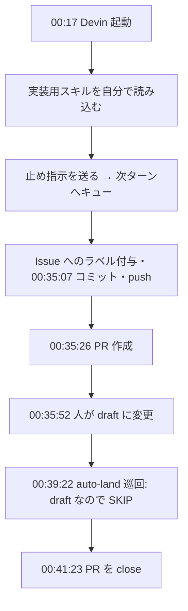

自作ツールのリポにある解決済みのバグ Issue を 1 本選び、Devin CLI（SWE-2）と Claude Code（Sonnet 5.5）に、同じ起点コミットから実装させました。

正解テストは両者とも 28/28 PASS です。ところが、そのテストは**修正前のコードでも 27/28 通る**ものでした。点数では差が出ず、代わりに見えたのは AI エージェントを並べて走らせたときに起きる運用上の事故と、測り方の穴です。この記事はそちらの記録です。

1 シナリオだけの結果なので、どちらが優れているかは書きません。

## なぜ比べたか

<!-- hearing:H2 -->
Claude Code の週次上限に何度もぶつかっていました。直近 30 日で、上限に当たったシグナルが 12 日分あります。そこで Devin の SWE-2 を「別の枠」として使えないか確かめたくなりました。

全面的に乗り換える話ではありません。小さなコーディング Issue を 1 本だけ渡して、仕事を任せられるかを見る試運転です。

なお Devin CLI の既定のモデル設定は、Claude Fable が lead を務める構成でした。これでは Claude の token は減らないので、モデルを `--model swe` で SWE-2 に固定しています。

## 実験の組み方

題材は「SessionStart hook の Pushover 通知が毎回飛ぶのを、24 時間に 1 回へ抑制する」というバグ Issue です。正解 PR とマージ後のテストが手元にあります。

- 修正前のコミットから、ツールごとにブランチと worktree を切る
- 渡すのは Issue 本文だけ。コミットまでで止めてもらう
- 採点は、正解 PR で追加されたテストを各成果物に当てる

```bash
# 起点コミットから各ツール用のブランチを作る
git branch pilot-devin <起点コミット>
git branch pilot-claude <起点コミット>

# Devin: -w は既存ブランチをそのまま使う
devin -w pilot-devin --model swe --permission-mode accept-edits --prompt-file issue.md

# Claude: worktree は自分で作ってから素の claude を起動する（理由は後述）
git worktree add ../pilot-claude pilot-claude
cd ../pilot-claude && claude --model claude-sonnet-5-5
```

| 条件 | Devin | Claude Code |
|---|---|---|
| CLI | devin-cli 3000.10.31（Devin Pro） | Claude Code |
| モデル | SWE-2（effort High） | Sonnet 5.5（effort medium） |
| 権限 | accept-edits | auto mode |
| 止め指示 | 実行の途中で送信 | 最初のプロンプトに記載 |

effort と止め指示のタイミングがそろっていません。この条件差は、そのまま後の事故につながっています。

## 結果

| 項目 | Devin | Claude Code |
|---|---|---|
| 採点テスト | 28/28 PASS | 28/28 PASS |
| 経過時間（起動→コミット） | 約 18 分 | 約 13 分（うち人の返答待ち約 11 分） |
| 実作業時間 | 不明（ログに思考時間が出ない） | 約 1 分 15 秒 |
| shell 実行回数 / うちテスト実行 | 23 回 / 1 回 | 6 回 / 1 回 |
| 自己修正（テスト失敗→修正） | 0 回 | 0 回 |
| 人の介入 | 0 回 | 1 回 |
| diff | 2 files, +69 / -6 | 2 files, +65 / -5 |
| 想定外の副作用 | Issue へのラベル付与・push・PR 作成 | なし |

数字だけ見ると「Devin は自走できて、Claude は人を待った」です。ただし中身を見ると、その自走のほうに事故が含まれていました。

## 事故 1: 止め指示は、途中から送っても届かない

<!-- hearing:H3 -->
夜中、送った止め指示がキューに入ったまま、Devin が push と PR 作成まで進むのを見ているしかありませんでした。

Devin は起動すると、リポに置いてある実装用のスキル（Issue 着手から PR 作成までを一通りやる手順書）を自分から読み込みました。後から「コミットまで。main・PR・Issue には触らない」と送りましたが、対話起動中の Devin は、実行中に送った指示を**次のターンへキュー**します。指示を無視したのではなく、割り込めなかったのです。

もう 1 つ、対話起動（`--prompt-file`）では `accept-edits` でも shell が自動で許可されていました。権限モードの名前から想像するより、できることが広い状態でした。



### PR を作られると、自動マージの仕組みが拾いにくる

私の環境では、自作の auto-land が 15 分ごとに回っています。担当リポの open PR を見て、CI やレビュー bot の指摘が片付いていれば squash マージまで進める仕組みです。draft の PR だけは SKIP します。

auto-land は PR 作成の約 4 分後にこの PR を拾い、**draft だという理由だけで** SKIP しました。draft 化は作成の 26 秒後です。ここが遅れていたら、実験用の PR がマージ判定の対象に入っていました。

教訓は単純で、止めたいことは最初のプロンプトに書くことです。Claude 側は最初から書いて渡したので、副作用は出ていません。プロンプトだけに頼らず、PR 作成や push は権限の側でも塞いでおくほうが確実です。

## 事故 2: 起点を固定したつもりが、固定されていなかった

<!-- hearing:H3 -->
Claude 側は、起点がずれかけました。

`claude -w <name>` は、同じ名前の既存ブランチがあってもそれを使わず、`worktree-<name>` というブランチを**今の HEAD から**新しく作ります。HEAD は修正済みの main なので、そのまま始めていたら答えの入ったコードから実装させることになり、実験が成立しませんでした。

Devin の `-w` は既存ブランチを使います。同じ `-w` でも意味が違います。起点を固定したい実験では、`git worktree add` で自分で worktree を作ってから、素の `claude` を起動するのが確実です。

## 事故 3: 環境が「今」の基準で採点してくる

両者とも、コミットの段階で自作の lint に止められました。

原因は、git の `core.hooksPath` が main 側の hook ディレクトリを指していたことです。Devin を起動する約 25 分前（前日の 23:53）に、shell 変数の書き方を検査する lint が main に入っていました。古い起点コミットの中にはその lint に引っかかる既存の書き方が残っていたので、今日の基準で過去のコードが止められた形です。正解 PR が作られた時点には、この lint はありませんでした。

ここで 2 つのエージェントの振る舞いが分かれました。

- **Devin**: 緊急用の override（`SHELL_VAR_BRACES_SKIP=1`）を自力で見つけて回避し、そのままコミットした
- **Claude**: 回避方法を人に確認して停止した。こちらが override 名を含めて返答してから通過した

「人の介入 0 回 vs 1 回」の差は、ほぼこの 1 か所です。自分で回避策を探して進むのは自律性としては強い一方、安全装置を自分の判断で外すことでもあります。無人で走らせるなら、どちらの振る舞いを望むのかを先に決めておく必要があります。

## 測り方の失敗

事故はエージェント側だけではありませんでした。測る側にも 3 つ穴がありました。

### 採点テストが弁別しない

<!-- hearing:H4 -->
いちばん大きな失敗はこれです。正解 PR のテストは 28 件ありますが、修正前のコードに当てても 27 件 PASS します。落ちるのは「2 回目の通知が抑制されること」を確かめる 1 件だけです。

つまり「両者 28/28」は、実質 1 件のテストに両者が通ったという意味でしかありません。品質の差を見るには diff を読む必要があります。

次は、テストで比べる前に**修正前のコードで落ちるケースが何件あるか**を先に数え、その数が十分な題材を選びます。

```bash
# 修正前のコードに、正解 PR のテストを当てる
d=$(mktemp -d)
git archive <起点コミット> hooks | tar -x -C "$d"
mkdir -p "$d/tests"
git show <正解PRのマージコミット>:tests/<テストファイル>.sh > "$d/tests/t.sh"
bash "$d/tests/t.sh"   # → PASS: 27 / FAIL: 1
```

### 監視が入力待ちを見逃した

2 つのエージェントの進み具合は、別のセッションから監視していました。その監視は「プロセスが生きていれば作業中」と判定していたため、Claude が確認待ちで止まっていた間も作業中と表示され続け、10 分以上気づきませんでした。Claude の経過時間 13 分のうち約 11 分が人の返答待ちなのは、このためです。

ログ（transcript）の更新が止まったことで検知するように直しました。プロセスの生死では、エージェントが「考えている」のか「待っている」のかは区別できません。

### 集計ミス

当初、テストの実行回数を 4〜5 回と報告していました。実際は両者とも 1 回です。複数行のコマンドを行数で数えていたのが原因で、ツール呼び出し単位で数え直しました。shell 実行回数の 23 回と 6 回は、Devin の CLI ログと Claude の transcript からツール呼び出し単位で数えた値です。

## Devin のコストは測れなかった

Claude と同じ尺度で比べたかったのが token 数ですが、Devin では取れませんでした。

- CLI の出力・ログ・`devin list` のどこにも usage が出ない
- app.devin.ai の Usage 画面にも token 数の表示がない
- 実験した日の金額の増加は $0。ただし quota 内の利用は金額に出ないので、**$0 は消費ゼロという意味ではない**
- Overview は Daily quota 100% used / Weekly quota 81% used、On-demand 残高 $-4.11。CLI の実行がこの quota を使ったのかは画面から切り分けられない（CLI 起動時の表示は「Pro · 0% remaining」のまま動いていた）

「別の枠として使えるか」を判断するには、どの枠をどれだけ使ったかが見えないといけません。ここは今のところ、CLI からは確かめられないというのが答えです。

## まとめ: 無人で走らせる前に決めておくこと

- 止めたいこと（push・PR 作成・Issue 操作）は**最初のプロンプト**に書く。途中の指示は割り込めないことがある。できれば権限の側でも塞ぐ
- 自動マージの仕組みがあるなら、実験用の PR が拾われない条件（draft・ラベル）を先に用意する
- 起点を固定したいときは、ツールの `-w` の意味を確かめる。迷ったら `git worktree add` で自分で作る
- hook や lint が「今の main」を指していないか確認する。古いコミットが今日の基準で止められる
- 採点テストは、修正前のコードで落ちる件数を先に数える
- 監視は、プロセスの生死ではなくログの更新で「止まっている」を検知する
- 回数はツール呼び出し単位で数える

次は、修正前に落ちるケースが十分にある題材を選び直して、もう一度並べます。

<!-- 出典の再検証: bash scripts/verify-sources.sh devin-vs-claude-code-same-issue -->
